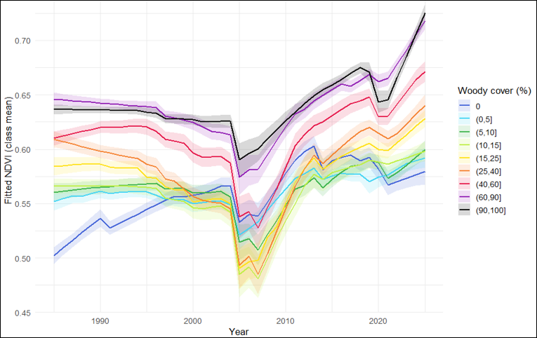

# Mapping Woody Plant Encroachment in Southern Alberta Grasslands, 1985–2025

A Landsat-based remote sensing pipeline using LandTrendr temporal segmentation
and Random Forest classification to track woody plant cover change across
~79 km² of ranch grassland in Tongue Creek Ranch and OH Ranch, Alberta/Saskatchewan.

## Overview


Woody plant encroachment threatens grassland ecosystems across the northern
Great Plains. This project quantifies four decades of change using annual
Landsat composites (1985–2025), LandTrendr fitted spectral trajectories,
and a Random Forest classifier trained on 2023 field measurements from
[N] sampled sites. Output is an annual multi-band classification of woody
cover into four classes: none, low (≤15%), moderate (≤40%), and high (>40%).

## Methods

- **Imagery**: Landsat 5/7/8/9 Collection 2 Tier 1 surface reflectance
- **Compositing**: Medoid composites over the growing season (DOY 153–244)
- **Sensor harmonization**: OLI-to-ETM+ regression (Roy et al. 2016 coefficients)
- **Temporal segmentation**: LandTrendr on 7 spectral bands (NDVI, B, G, R, NIR, SWIR1, SWIR2)
- **Classification**: Random Forest (scikit-learn), tuned via 5-fold CV on 2023 field data
- **Reference**: [Denning et al. 2026](https://doi.org/[DOI])

## Repository structure

```
gee-scripts/         GEE JavaScript scripts (run in Code Editor)
  01_data-prep/      Landsat compositing and scene filtering
  02_landtrendr/     LandTrendr fitting and multi-band export
  03_sampling/       Field-site sampling and diagnostics
python/              Random Forest training and multi-year prediction
docs/                Extended methodology, figures
data/                Asset locations and access notes
```

## Reproducing this work

**GEE scripts**: Copy the contents into the [GEE Code Editor](https://code.earthengine.google.com).
Each script's header lists the required input assets and outputs it produces.
Scripts are numbered to indicate execution order.


## Author

Mohammed — Research Assistant, Department of Geography and Planning, University of Saskatchewan
Email: moha.mmed@usask.ca · 
Linkdin: www.linkedin.com/in/mohammed-06b4b1351/
